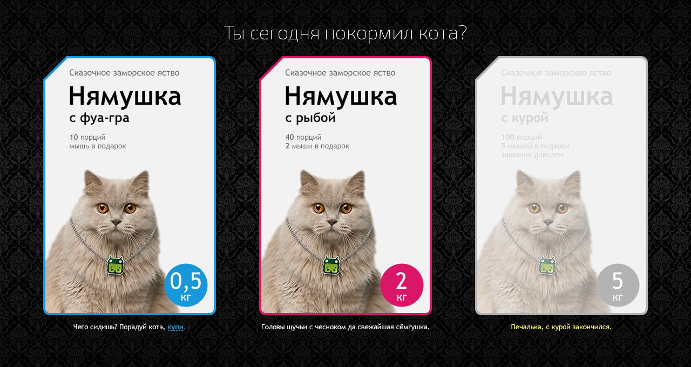

# Проект: адаптивный интернет магазин CatFoodShop.

### [ Ссылка на проект ](https://rassellek.github.io/cat-food-shop-react-app/)

### Цель и задачи проекта:

Реализовано веб-приложение (сайт), содержащее страницу, внешний вид которой
соответствовует макету, а поведение — описанию задачи. Макет находится в папке
prototype, описание задачи ниже.

Task Requirements:

<ul>
<li>Фон занимает всю площадь экрана, блок находится по центру вертикально и горизонтально.</li>
<li>На планшетах упаковки располагаются треугольником, на смартфонах друг под другом.</li>
<li>Информация о продукте может меняться.</li>
<li>Каждая из упаковок может быть выбрана или недоступна для выбора. Выбор осуществляется нажатием на упаковку или на текст «купи» в описании.</li>
<li>Можно выбрать одновременно несколько упаковок, а также отменить свой выбор повторным нажатием на упаковку.</li>
<li>Состояние наведения применяется к выбранной упаковке не сразу, а после того, как курсор ушел с нее после первоначального выбора.</li>
</ul>

### Дополнительные возможности реализованные в проекте:

<ul>
<li>Информация о продукте и колличество продуктов может меняться и запрашивается из файла ./src/data/products.js</li>
<li>Использование препроцессоров.</li>
<li>Использование библиотеки classNames для валидации.</li>
</ul>

 

### Данный проект создавался на стеке:

 

### Используемые программы:

